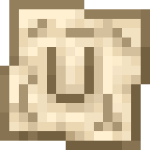

# wUtilities



wUtilities lets a Minecraft server disable all or selected client features in wWorldMap and wWaypoints. It supports Minecraft 1.20 and newer through platform-specific artifacts:

- Bukkit: Spigot, Paper, and Folia (plus compatible derivatives such as Purpur and Leaf);
- Fabric and Quilt through the shared Fabric-compatible server artifact;
- native Forge artifacts for the versions supported by the clients;
- native NeoForge artifacts across the 1.20+ compatibility cohorts.

Clients without either supported mod can join normally. Architectury Loom and Stonecutter provide the cross-version build, while runtime adapters use native platform APIs; no Architectury API runtime JAR is required.

## Build

```powershell
.\gradlew.bat buildAll
```

Deployable JARs are collected under `build/artifacts`. Source JARs are not deployable. See [platform support and artifact selection](documentation/PLATFORMS.md) for the complete matrix.

## Install

- Spigot/Paper/Folia: put the Bukkit JAR in `plugins`.
- Fabric/Quilt: put the matching Fabric cohort JAR and Fabric API in `mods`.
- Forge/NeoForge: put the matching native loader JAR in `mods`.

Start once to generate `wutilities.properties`, edit it, and restart. Bukkit-family servers store it under `plugins/wUtilities`; mod loaders store it under `config`. Existing `wWorldMapUtils/wworldmap-utils.properties` and `config/wworldmap-utils.properties` files are copied forward automatically on first startup after upgrading.

```properties
disable-wworldmap=false
disabled-wworldmap-features=cave-mode,entity-radar
disable-wwaypoints=false
disabled-wwaypoints-features=sneak-modifications,sign-modifications
```

wWorldMap feature IDs are `entire-mod`, `player-radar`, `entity-radar`, `orbit`, and `cave-mode`.

wWaypoints feature IDs are `entire-mod`, `sneak-modifications`, and `sign-modifications`. Underscores are accepted as aliases in configuration. Unknown feature IDs are ignored with a warning. Local client preferences are never overwritten; server policy is an additional connection-scoped restriction.

Both protocols use version 1, on independent channels: `wworldmap:policy` and `wwaypoints:policy`. See the [protocol specification](documentation/PROTOCOL.md), [platform guide](documentation/PLATFORMS.md), and [third-party integration guide](documentation/THIRD_PARTY_INTEGRATION.md).

## Development servers

`runServer.bat` prepares an isolated 1.21.11 Fabric or Bukkit-family development server under `servers/`, builds the correct artifact, installs it, and launches the selected server. Use loader-native run configurations or a normal test server for the other compatibility cohorts.
